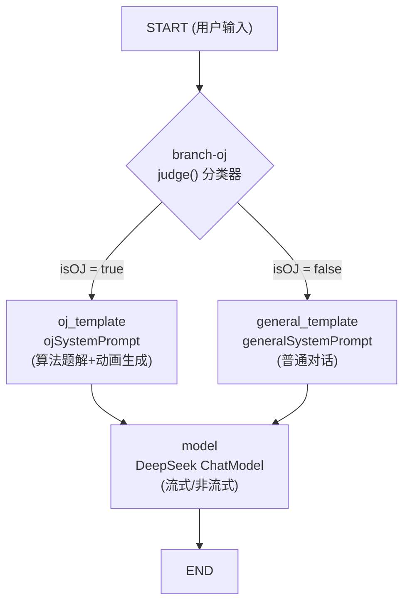

# Oj-Agent

> 输入一道算法题，自动生成带有动画演示的题解。

Oj-Agent 是一款基于 Wails3 的跨平台桌面应用，结合 LLM 大模型能力，将枯燥的算法题解转化为可视化的动画演示，帮助用户更直观地理解算法思路。

---

## 核心功能

- **智能题解生成**：输入题目描述，自动调用 LLM 生成解题思路、代码实现和时间/空间复杂度分析
- **动画演示**：将算法执行过程（如双指针、递归、动态规划、图遍历等）以动画形式逐步展示
- **本地持久化**：所有题目和题解存储在本地 SQLite 数据库中，支持历史记录检索
- **多语言支持**：支持生成多种编程语言的题解代码（Go、Python、C++、Java 等）

---

## 技术栈

| 层级     | 技术                                      |
| -------- | ----------------------------------------- |
| 后端     | Go 1.25+                                  |
| AI 编排  | [eino](https://github.com/cloudwego/eino) |
| 桌面框架 | [Wails3](https://v3.wails.io/)            |
| 数据存储 | SQLite                                    |
| 前端     | Vue 3 + Vite                              |

---

## 项目结构

```
Oj-Agent/
├── backend/            # Go 后端核心逻辑
│   ├── agent/          # eino agent 编排（prompt 模板、工具链等）
│   ├── llm/            # LLM 调用封装（OpenAI / 本地模型）
│   ├── parser/         # 题解内容解析（提取算法步骤、代码块）
│   ├── anim/           # 动画数据生成（将算法步骤转为动画帧）
│   ├── db/             # SQLite 数据库操作
│   └── server/         # Wails3 后端 API
├── frontend/           # 前端页面 (Vue 3)
│   ├── src/
│   │   ├── components/ # UI 组件
│   │   ├── pages/      # 页面
│   │   └── anim/       # 动画渲染引擎（Canvas / SVG）
│   └── package.json
├── build/              # 构建配置（多平台）
├── go.mod
├── go.sum
├── main.go             # 应用入口
├── greetservice.go     # 示例 Service
├── Taskfile.yml        # Task 任务配置
└── README.md
```

---

## 快速开始

### 环境要求

- Go 1.25+
- [Wails3 CLI](https://v3.wails.io/getting-started/your-first-app/)
- Node.js 18+
- SQLite 3

### 安装与运行

```bash
# 克隆项目
git clone https://github.com/your-org/Oj-Agent.git
cd Oj-Agent

# 设置环境变量（将 xxx 替换为你的 API Key）
cp .env

# 安装前端依赖
cd frontend && npm install && cd ..

# 生成 Wails3 绑定
wails3 generate bindings

# 开发模式启动
wails3 dev
```

---

## 配置

在 `.env` 中配置 LLM 相关参数：

```env
# OpenAI 兼容 API
OPENAI_API_KEY=sk-xxx
OPENAI_BASE_URL=https://api.openai.com/v1
OPENAI_MODEL=gpt-4o

# 本地模型（可选，使用 Ollama 等）
# OPENAI_BASE_URL=http://localhost:11434/v1
# OPENAI_MODEL=qwen2.5:7b
```

---

## 工作原理

### 1. 整体架构

```
┌─────────────────────────────────────────────────────────────────┐
│                        OJ Agent (Wails v3)                       │
├─────────────────────────────────────────────────────────────────┤
│  Frontend (Vue 3)          │  Backend (Go)         │  External   │
│  ┌──────────────────┐      │  ┌─────────────────┐  │  ┌────────┐ │
│  │ ChatArea.vue     │◄────►│  │ chatservice.go  │  │  │DeepSeek│ │
│  │ (Markdown 消息)   │      │  │ (会话/流/解析)   │──┼─►│  API   │ │
│  └──────────────────┘      │  └─────────────────┘  │  └────────┘ │
│  ┌──────────────────┐      │  ┌─────────────────┐  │             │
│  │AnimationPanel.vue│◄────►│  │  llm/            │  │             │
│  │ (SVG 动画播放器)  │      │  │  ├ deepseek.go   │  │             │
│  └──────────────────┘      │  │  ├ parser.go     │  │             │
│                            │  │  └ retry.go      │  │             │
│                            │  └─────────────────┘  │             │
│                            │  ┌─────────────────┐  │             │
│                            │  │  storage/db.go   │  │             │
│                            │  │  (SQLite 持久化)  │  │             │
│                            │  └─────────────────┘  │             │
└─────────────────────────────────────────────────────────────────┘
```

### 2. eino Graph 编排流程

项目使用 [cloudwego/eino](https://github.com/cloudwego/eino) 作为 LLM 编排框架。



#### 2.1 judge() 分类器

```go
// llm/deepseek.go:520
func (c *Client) judge(ctx context.Context, problem string) bool
```

两步判断：

| 步骤 | 方法 | 说明 |
|------|------|------|
| 1 | LLM 分类 | 发送分类 prompt，让 LLM 返回 `true`/`false` |
| 2 | 关键词回退 | LLM 调用失败时，用 40+ 中文/英文算法关键词匹配 |

关键词包括：`算法`、`数组`、`链表`、`dp`、`two sum`、`leetcode` 等。

#### 2.2 两种 Prompt 模板

| 模板 | 用途 | 特点 |
|------|------|------|
| `ojSystemPrompt` | 算法题解 + 动画生成 | ~330 行，包含动画 schema、示例、自检清单 |
| `generalSystemPrompt` | 普通对话 | "你是一个有用的AI助手" |

### 3. 流式响应处理流程

```
chatservice.go:streamGenerate()
        │
        ▼
Client.Stream()  ──── eino Graph ──── DeepSeek API
        │                                    │
        │  ◄──────── *schema.Message ────────┘
        │           (流式 SSE chunk)
        ▼
┌──────────────────────────────────────┐
│  读取循环 (recvErr != io.EOF)         │
│                                      │
│  msg.Content                         │
│  msg.ResponseMeta.Usage → callback   │
│                                      │
│  accumulated += msg.Content          │
│  filtered = filterAnimBlocks()       │
│  emit("chat-chunk", filtered) ──────► 前端实时渲染 Markdown
└──────────────────────────────────────┘
        │ (流结束)
        ▼
┌──────────────────────────────────────┐
│  ParseResponse(accumulated)           │
│  ├─ 切分 Markdown / ---ANIM---       │
│  ├─ repairJSON() 修复畸形 JSON        │
│  ├─ isValidAnimJSON() 验证字段        │
│  └─ 返回 AnimResponse                 │
└──────────────────────────────────────┘
        │
        ▼
┌──────────────────────────────────────┐
│  parseAnimJSON() × N                  │
│  ├─ repairJSON()                      │
│  ├─ json.Unmarshal                    │
│  ├─ delta 引用校验 (id 是否存在)       │
│  ├─ autoFitAnim() 坐标平移+SVG自适应   │
│  └─ 返回 UnifiedAnim                  │
└──────────────────────────────────────┘
        │
        ▼
┌──────────────────────────────────────┐
│  checkAnimsBounds()                   │
│  ├─ rect/circle/line/label 边界检查   │
│  └─ margin = 8px                      │
└──────────────────────────────────────┘
        │
   ┌────┴────┐
   │ 越界?    │
   └────┬────┘
    YES │          NO
        ▼           ▼
  GenerateWithRetry    emit("chat-complete")
  (最多 10 轮重试)      ──► 前端播放动画
```

### 4. 解析器 (parser.go)

#### 4.1 ParseResponse 主逻辑

```
原始 LLM 输出
  │
  ├─ 有 "---ANIM---" ?
  │   YES → 第一部分 = Markdown, 剩余按分隔符切块
  │   NO  → 查找 ```json 兜底
  │
  └─ 每个动画块:
      ├─ extractLabel()   提取 "用例1: xxx" / "条件: xxx"
      ├─ parseAnimBlock() 找到 JSON 体
      └─ isValidAnimJSON() 验证 elements + frames 字段
```

#### 4.2 repairJSON() — JSON 自动修复

```
原始 JSON → 删除尾逗号 (,\s*[}\]]) → 补齐缺失的闭合括号
```

- 处理 LLM 常见的 JSON 语法错误
- 只做安全修复，不过度猜测

#### 4.3 extractLabel() — 标签提取

支持的标签前缀：

| 中文 | 英文 | 示例 |
|------|------|------|
| 用例N: | case N: | `用例1: 正常匹配` |
| 条件: | | `条件: arr[i] < pivot` |
| 示例: | | `示例: *匹配0个字符` |
| 分支: | | `分支: 递归归并` |
| 场景: | | `场景: 栈pop` |

### 5. 动画生成与验证

#### 5.1 动画 JSON Schema

```json
{
  "svgW": 440,          // SVG 视口宽度
  "svgH": 130,          // SVG 视口高度
  "elements": [         // 初始场景元素
    {
      "id": "a0",       // 唯一 ID
      "kind": "rect",   // rect|circle|line|label|polygon|path|group
      "x": 10, "y": 50, "w": 48, "h": 40,
      "text": "5",
      "style": "normal" // normal|highlight|compare|swap|result|pivot|dim
    }
  ],
  "frames": [           // 增量动画帧
    {
      "desc": "3<5 swap",
      "delta": {        // 只写变化量
        "a0": {"style": "highlight"},
        "a1": {"x": 62, "text": "3"}
      }
    }
  ]
}
```

#### 5.2 autoFitAnim() — 坐标自动修正

```
1. 计算所有元素的包围盒 (BBox)
   - rect:   (x, y) ~ (x+w, y+h)
   - circle: (cx-r, cy-r) ~ (cx+r, cy+r)
   - line:   min(x,x2), min(y,y2) ~ max(x,x2), max(y,y2)
2. 如果最小 x < 12px → 整体右移 (margin - minX)
3. 同时平移所有帧中的 delta 坐标
4. 扩展 svgW/svgH 以容纳平移后的元素
```

#### 5.3 验证链路

| 验证项 | 位置 | 不通过时 |
|--------|------|----------|
| JSON 语法 | `isValidAnimJSON()` | 跳过该动画 |
| elements/frames 非空 | `isValidAnimJSON()` | 跳过该动画 |
| delta 引用 ID 存在 | `parseAnimJSON()` | 返回 false |
| 坐标不越界 | `checkAnimsBounds()` | 触发重试 |

#### 5.4 重试机制 (retry.go)

```
GenerateWithRetry() 最多 10 轮:
  ├─ 第1轮: 用 ojSystemPrompt 生成
  │   ├─ 检查 delta 引用错误
  │   ├─ 检查坐标越界 (含 autoResizeAnim 修正)
  │   └─ 通过 → 返回
  │
  └─ 第2~10轮: 构造具体错误提示
      ├─ "元素 e0 x=-5 太靠左"
      ├─ "帧3 delta 引用未知元素 xyz"
      └─ 重新请求 LLM 修复
```

#### 5.5 重试激活条件

```go
needsAnimation := strings.Contains(accumulated, "---ANIM---")
needRetry := needsAnimation && len(anims) == 0
```

**只有** LLM 确实尝试生成了 `---ANIM---` 但 JSON 解析失败时才重试。普通聊天不会触发重试。

### 6. Token 用量统计

```
LLM API 响应 (*schema.Message)
  └─ ResponseMeta.Usage
      ├─ PromptTokens       → 输入 token
      ├─ CompletionTokens   → 输出 token
      └─ TotalTokens        → 总量

StreamReaderWithConvert() 包装流
  └─ 每个 chunk 检查 ResponseMeta.Usage
      └─ TokenCallback(TotalTokens) → atomic.Int64 累加

streamGenerate() 结束时:
  ├─ pendingTokens.Swap(0) → 本次会话用量
  └─ 为 0 时降级: estimateTokens() = len([]rune) * 2/3
```

### 7. 前端动画渲染

```
AnimationPanel.vue                   UniversalRenderer.vue
┌──────────────────────────┐       ┌──────────────────────────┐
│  controls (播放/暂停/步进) │       │  initState()              │
│  tabs (多用例切换)         │       │  ├─ elements → state{}    │
│  progress bar             │       │  └─ kind + coords + text  │
│                           │       │                          │
│  currentStepIndex ────────┼──────►│  applyFrame(idx)          │
│  isPlaying                │       │  ├─ for each delta[id]    │
│  fullscreen (Teleport)    │       │  │  └─ apply changes      │
│                           │       │  └─ warn unknown id       │
│  键盘: Space/←→/R/Esc     │       │                          │
│  焦点检测: 输入框中不触发   │       │  渲染:                   │
└──────────────────────────┘       │  ├─ rect + glow pulse      │
                                   │  ├─ circle + outer ring    │
                                   │  ├─ line + arrow           │
                                   │  ├─ label + badge          │
                                   │  ├─ polygon (pointer)      │
                                   │  ├─ path (bezier)          │
                                   │  └─ group (overlay)        │
                                   └──────────────────────────┘
```

### 8. 数据持久化

```
SQLite (modernc.org/sqlite)
  ├─ sessions 表
  │   ├─ id, title, created_at, updated_at
  │   └─ ChatService.sessions map[string]*ChatSession
  │
  └─ messages 表
      ├─ session_id (外键), role, content, time
      ├─ animation (JSON text → []UnifiedAnim)
      └─ 启动时 loadFromDB() 恢复所有会话
```

### 9. 关键配置

| 配置项 | 环境变量 | 默认值 |
|--------|----------|--------|
| API Key | `DEEPSEEK_API_KEY` / `OPENAI_API_KEY` | - |
| Base URL | `DEEPSEEK_BASE_URL` / `OPENAI_BASE_URL` | `https://api.deepseek.com` |
| Model | `DEEPSEEK_MODEL` / `LLM_MODEL` | `deepseek-chat` |

可通过前端 SettingsModal 动态修改，无需重启。

-----


## License

MIT License
